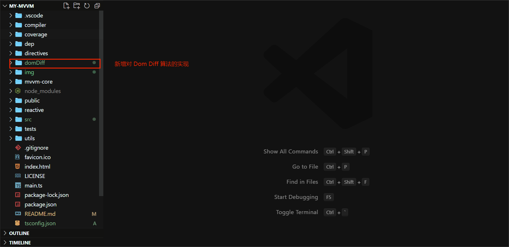
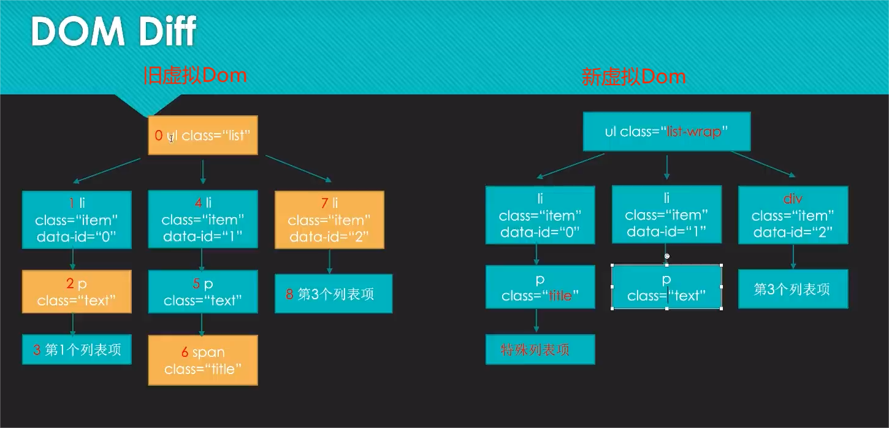
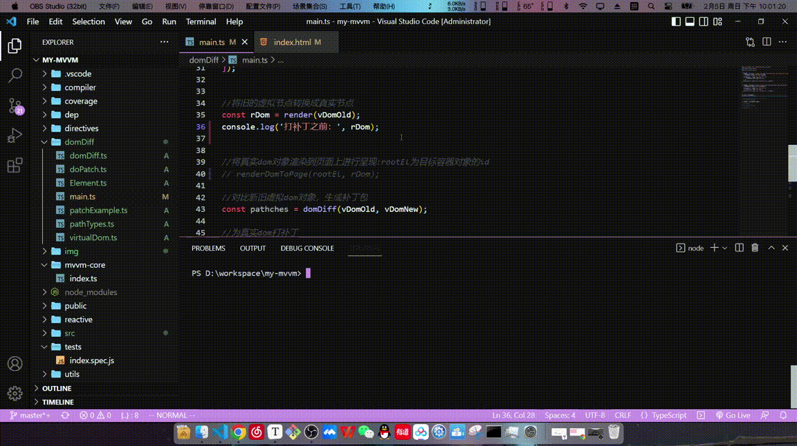

### 写在前面：设计和编码原则

- 不过度追求项目的复杂性，力求阐释清楚 my-mvvm 的架构设计和各模块之间的关系
- 争取测试环境的便捷和高效，使用较为完整的生态去开发和测试，力求项目后期的可维护和易扩展
- 在完成预计功能和代码稳定运行的前提下，力求代码的简单明了

### 仓库说明

- 用于存放2023百度前端实战训练营的大作业：实现一个简易的 MVVM 框架

### 项目简介

- 项目名称：my-mvvm
- 功能实现
  - 数据深度劫持
  - 依赖收集  （回调函数的收集，用于辅助后续功能的实现）
  - 数据单向和双向绑定
  - 消息的订阅与发布
  - 模板解析   (初次渲染)
  - 响应式页面更新   (响应式渲染)
  - 实现 Dom Diff 算法  (最小代价的更新真实dom)
- 作者：王勋
- 学校：东北林业大学 
- 专业年级：20级本科  软件工程
- 个人或组队：个人
- 博客园地址:  https://www.cnblogs.com/nefu-wangxun/  欢迎相互交流学习

### 亮点

- 项目架构层次：

  - 使用vite构建项目，并配套使用vitest作为前端测试框架，项目构建和测试更加简洁高效，便于维护
  - 分模块进行开发，各模块职责分明，耦合度低，易于扩展
- 技术实现层次：

  - 实现reactive方法，数据深度劫持，实现了getDeepValue和setDeepValue方法，灵活获取和修改对象的深层次属性
  - 实现Compiler类，完成模板解析，对页面进行初始渲染，并可将不同自定义指令方便的映射到对应的处理方法上
  - 构建了customDirectives对象，对自定义指令进行了封装，使自定义指令易管理，易扩展
  - 实现Dep类，进行依赖收集，可便捷的帮助实现数据的双向绑定，响应式页面，以及消息的订阅与发布
  - 实现了 Dom Diff 算法
    - 可实现虚拟节点的创建，虚拟节点到真实dom节点的渲染，真实dom节点在页面的渲染
    - 可以完成新旧虚拟节点的比对，得到用于更新真实dom的补丁包
    - 可向旧虚拟节点对应的真实节点打补丁，最小代价的更新真实dom
- 其他：
  - 注释详细，易于阅读和维护
  - vitest单元测试详细：对 v-model，v-bind,  {{}}插值语法，深度数据劫持，依赖收集，消息订阅与发布等都进行了测试
  - 配合动态演示图，可以更直观的理解 my-mvvm 的设计和测试过程


---

### 效果预览

- my-mvvm 框架代码运行演示：    **(点击动态图或图片可以放大查看，更清晰)**


- my-mvvm 测试代码运行演示： **包含3个大的测试用例，共7个小测试用例，都运行通过**


---

### 项目结构说明

> 红字标识的目录和文件是作者创建完成的，其余文件和目录是项目构建工具生成的


---

### MVVM 框架设计思路

- MVVM整体架构


- 本质上，MVVM的核心就是充当驱动的ViewModel层，ViewModel通过对数据的监测和绑定，并通过触发和响应事件，实现数据的维护和视图的更新
- 所以此简易的 my-mvvm 框架的核心也是维护一个ViewModel类，来统筹整个框架

---

### my-mvvm 架构设计

#### 架构设计图

- 核心类和方法的架构设计图如下：深红色表示核心类和操作，其他颜色用于区别职责划分

- 数字编号代表大致的执行流程，初次渲染之后的执行流程视触发的事件而定


#### 架构设计图分析

- 步骤1：首先明确待服务的容器对象，并准备好页面初次渲染时以及后续需要的数据
- 步骤2：存储待服务的目标容器信息，对传来的数据进行数据劫持，新增模板编译器对象和依赖收集器对象
- 步骤3，4：通过模板编译器对象，借助目标容器信息，对目标模板进行编译
- 步骤5：将解析出的自定义指令映射到customDirectives对象中封装的处理方法上
  - (重要) 并进行必要的依赖收集(回调函数的收集)，数据解析，事件绑定
- 步骤6：根据模板解析得到的数据，初次渲染页面
- 步骤7：当触发了绑定的事件或修改了数据时，触发setter函数，更新数据
  - (重要) 并调用notify通知之前收集的回调函数执行，重新解析模板
- 步骤8：将更新后的数据响应到页面上，实现页面的动态更新

---

### my-mvvm 核心类和方法分析

#### ViewModel类

> my-mvvm 的核心类，用于统筹整个框架

```ts
/**
 * 构造my-mvvm框架的核心：ViewModel类
 * 
 */


//引入模板编译器
import Compiler from "../compiler/Compiler";

//引入依赖收集器
import Dep from "../dep/Dep";

//引入数据劫持方法
import reactive from "../reactive/reactive";

export default class ViewModel {
    $el:HTMLElement;
    $data:Object;
    dep:Dep
    compiler:Compiler
    
    //解构传来的options配置对象
    constructor({
        el,  //string
        data //function
    }){
        
        //拿到待操作的容器对象
        this.$el = document.querySelector(el);

        //对传来的data数据进行数据劫持
        this.$data = reactive(this, data());

        //在vm对象上添加一个依赖收集对象
        this.dep = new Dep();

        //编译页面
        this.compiler = new Compiler(this);
    }
}
```

#### reactive方法

> 对传来的数据对象进行深度数据劫持, 并对有过依赖收集的变量进行消息通知，执行回调函数

```ts
/**
 * 对传来的数据对象进行数据劫持
 */

import ViewModel from '../mvvm-core';

export default function reactive (vm:ViewModel, data:Object) {
    
    return new Proxy(data, {
        get: (target, key) => {
            const value = Reflect.get(target, key); //return target[key]
            return value !== null && typeof value === 'object' ? reactive(vm, value) : value; //深度劫持
        },
        set: (target, key, value) => {
            //修改数据，并记录是否修改成功
            const isSuccess = Reflect.set(target, key, value); //target[key] = value

            //数据修改时，通知并执行对应的回调函数数组中的回调函数
            vm.dep.notify(key);
            
            return isSuccess;
        }
    })
}
```

#### Compiler类

> 将待服务的目标模板，分为元素节点和文本节点两大类进行解析，并将自定义指令映射到对应的处理方法上

```ts
/**
 * 编译器:编译待服务的容器对象所对应的html模板文件，解析自定义标签
 */


//引入编译页面时需要使用的工具类
import CompilerUtils from "../utils/CompilerUtils";

//引入封装了所有自定义指令的对象
import customDirectives from "../directives/customDirectives";

//引入正则表达式对象:判断是否为插值语法格式
import {isInterpolationSyntax} from "../utils/RegExprUtils";

import ViewModel from "../mvvm-core";

export default class Compiler {
    vm:ViewModel

    constructor(vm:ViewModel){
        this.vm = vm;

        //初次编译
        this.compile(this.vm.$el);
    }

    //对节点进行初步编译
    compile($el:HTMLElement){

        const childNodes = $el.childNodes;  //得到目标容器对象的所有子节点

        //按照 元素节点，文本节点 两大类进行模板解析
        [...childNodes].forEach(node => {
            if(CompilerUtils.isElementNode(node)){
                this.compileElement(this.vm, node); //编译元素节点
                this.compile(node);     //递归遍历该节点，处理其可能存在的子节点
            }else{
                this.compileText(this.vm, node);    //编译文本节点
            }
        })
    }

    //编译元素节点
    compileElement(vm:ViewModel, node:HTMLElement){
        const attrs = node.attributes;  //获取元素节点的所有属性
        [...attrs].forEach(attr => {
            //判断属性名是否为自定义指令
            if(CompilerUtils.isDirective(attr.name)){
                //如果包含自定义指令，获取自定义指令的具体类型并拿到自定义指令的值
                const [, vType] = attr.name.split('-'); //v-model -> ['v', 'model']，这里只要数组的第二个元素
                customDirectives[vType](vm, node, attr.value);  //根据具体的自定义指令类型，调用对应的处理函数
            }
        })
    }

    //编译文本节点
    compileText(vm:ViewModel, node:HTMLElement){
        const text = node.textContent;
        if(isInterpolationSyntax.test(text)){
            //如果符合插值语法对应的正则表达式,进行插值语法的解析
            customDirectives['text'](vm, node, text);
        }
    }
}
```

#### customDirectives对象

> 封装了自定义指令，根据编译结果，映射到对应的处理方法

```ts
/**
 * 封装各种具体的自定义指令
 */


import {isInterpolationSyntax} from "../utils/RegExprUtils";

import {getDeepValue, setDeepValue} from "../utils/deepValueUtils";

import ViewModel from '../mvvm-core';

export default {
    
    /**
     * bind: v-bind 单向数据绑定
     * model: v-model 双向数据绑定
     * text: {{}} 插值语法
     */

    bind(vm:ViewModel, node:HTMLElement, value:String){
        //初次渲染元素节点中的value
        node.value = getDeepValue(vm.$data, value);
        
        //移除页面中的v-bind属性
        node.removeAttribute('v-bind'); 
    },
    model(vm:ViewModel, node:HTMLElement, value:String) {
        //初次渲染元素节点中的value
        const callBack = () => node.value = getDeepValue(vm.$data, value);//获取vm.$data中的属性值
        callBack();

        //收集依赖:实现数据的双向绑定
        const prop = value.split('.').slice(-1);//获取变量名
        vm.dep.add(prop, callBack);
       

        //绑定input监听事件
        node.addEventListener('input', () => {
            //更新vm.$data中的属性值
            setDeepValue(vm.$data, value, node.value);
        }, false)
        
        //移除页面中的v-model属性
        node.removeAttribute('v-model'); 
    },
    text(vm:ViewModel, node:HTMLElement, text:String) {
        //保存绑定的变量名
        let variableName = '';

        //初次渲染文本节点中的value
        const callBack = () => {
            //将文本节点内容中的插值语法表达式，替换成插值语法表达式中变量对应的值，如:{{ title }} -> title
            node.textContent = text.replace(isInterpolationSyntax, (textNode, key) => {
                key = key.trim();
                variableName = key; //保存变量名
                return getDeepValue(vm.$data, key);
            })
        }
        callBack();

        //依赖收集: 实现双向数据绑定
        const prop = variableName.split('.').slice(-1);//获取变量名
        vm.dep.add(prop, callBack);
    }
}
```

#### Dep类

> 进行依赖收集，帮助实现数据的双向绑定和消息的发布与订阅

```ts
/**
 * 进行依赖收集
 */


export default class Dep {

    //将绑定的变量名作为key,修改该变量值的操作封装成一个个callBack回调函数并放到一个专门属于该变量的回调函数数组中
    add(key:String, callBack:Function){
        !this[key] ? this[key] = [callBack]
                   : this[key].push(callBack);
    }

    //如果进行过依赖收集，当绑定的数据被修改时，通知回调数组中的所有回调函数执行，更新数据
    notify(key:String){
        if(this[key]){ 
            this[key].forEach(callBack => callBack());
        }
    }

}
```

#### utils 核心工具类和方法

- CompilerUtils：编译模板时使用到的方法

```ts
/**
 * 封装在编译模板时需要用到的一些方法
 */


export default class CompilerUtils {
    
    //判断节点是否为元素节点
    static isElementNode(node:HTMLElement) {
        return node.nodeType === 1;
    }

    //判断属性名中是否含有自定义指令
    static isDirective(attrName:String) {
        return attrName.includes('v-');
    }
}
```

- deepValueUtils：读取和设置对象的深层属性

```ts
/**
 * 根据传入的对象和获取路径，返回目标层次深度所对应的值
 * 例如：
 * obj:{
 *  a:{
 *     b:{
 *       c:1
 *      }
 *    }
 *  }
 * 
 * 则传入 obj 和 'a.b.c' 应当返回 1
 */


//获取对象的深层次属性值
export function getDeepValue(targetObj:Object,path:String){
    let res = obj;
    let current = '';
    let pathArr = path.split('.'); //形如:['a', 'b', 'c']
    while(current = pathArr.shift()){
        res = res[current];
    }
    return res;
}


//设置对象的深层次属性值
export function setDeepValue(targetObj:Object, path:String, newValue:String){
    let res = obj;
    let current = '';
    let pathArr = path.split('.');
    let n = pathArr.length;
    while(current = pathArr.shift()){
        n--;
        if(n == 0){
            res[current] = newValue; //修改目标属性值为新值
            break;
        }
        res = res[current];
    }
}
```

- RegExprUtils：封装使用到的正则表达式

```ts
/**
 * 封装使用到的正则表达式
 */


//判断是否满足双花括号的插值语法格式, 即：{{}}
export const isInterpolationSyntax = /\{\{(.+?)\}\}/
```

---

### 单元测试

- 使用与vite相互配套的vitest进行单元测试，并用happy-dom作为dom测试环境

- 测试包含3个大的测试用例，共7个小测试用例，都运行通过

- 测试文件放在tests目录中

```js
import { test, expect } from 'vitest';

import ViewModel from '../mvvm-core';


test('测试: v-model 和 插值语法', () => {
    document.body.innerHTML = `
        <div id="root">
            <h3 id='poemContent'>{{ content.poem }}</h3>
            <input type="text" placeholder="Please type the poem ..." v-model="content.poem" />
        </div>
    `
    const vm = new ViewModel({
        el:'#root',
        data(){
            return {
                content:{
                    poem:'偶尔想念'
                }
            }
        }
    })

    //测试页面初次渲染时，模板是否正常解析
    expect(document.getElementById('poemContent').innerText === '偶尔想念').toBe(true);

    //修改poem值
    vm.$data.content.poem = '经常偶尔';

    //测试双向数据绑定是否成功，页面是否响应式的变化
    expect(document.getElementById('poemContent').innerText === '经常偶尔').toBe(true);

})


test('测试: v-bind 和 插值语法', () => {
    document.body.innerHTML = `
        <div id="root">
            <h3 id='poemContent'>{{ poem }}</h3>
            <input id='input' type="text" placeholder="Please type the title ..." v-bind="poem" />
        </div>
    `
    const vm = new ViewModel({
        el:'#root',
        data(){
            return {
                poem:'偶尔想念'
            }
        }
    })
    //测试初始渲染
    expect(document.getElementById('poemContent').innerText === '偶尔想念').toBe(true);
    expect(document.getElementById('input').value === '偶尔想念').toBe(true);
    
    //修改poem
    vm.$data.poem = '经常偶尔';
    
    //测试文本节点是否正常的响应式更新
    expect(document.getElementById('poemContent').innerText === '经常偶尔').toBe(true);
    
    //测试单向数据绑定是否成功，input中的数据应当不随着poem的改变而更新
    expect(document.getElementById('input').value === '偶尔想念').toBe(true);
})


test('测试: 深度数据劫持 和 消息订阅与发布', () => {
    const vm = new ViewModel({
        el:'#root',
        data(){
            return {
                a:{
                    b:{
                        c:{
                            d:1
                        }
                    }
                }
            }
        }
    })

    //一旦d值被修改，由于对data数据进行了深度数据劫持，可以检测到d值修改，同时通知消息回调函数执行

    //通过result是否修改，判断回调函数是否执行
    let result = '';
    
    //消息回调函数
    const callBack = () => {
        result = 'd被修改了';
    }
    
    //对d进行依赖收集
    vm.dep.add('d', callBack);
    
    //修改d值
    vm.$data.a.b.c.d = 2;
    
    expect(result === 'd被修改了').toBe(true);
    
})
```

#### 测试过程演示


---

### my-mvvm 代码演示

#### 演示过程


#### 演示结果分析

- html核心代码

```html
<body>
    <!--模块化引入-->
    <script type="module" src="./main.ts"></script>
    
    <!--单向数据绑定，双向数据绑定，深度数据劫持，消息的订阅与发布-->
    <div id="root">
        <h3>标题: {{ title }}</h3>
        <h3>内容: 偶尔想念, {{ content.poem }}</h3>
        双向数据绑定: <input type="text" placeholder="Please type the content ..." v-model="content.poem" />
        单向数据绑定: <input type="text" placeholder="Please type the title ..." v-bind="title" />
    </div>
</body>
```

- main.ts

```ts
//引入my-mvvm框架的核心，即:ViewModel类
import ViewModel from "./mvvm-core";

const vm = new ViewModel({
    el:'#root',
    data(){
        return {
            content:{
                poem:''
            },
            title:'my mvvm'
        }
    }
})
```

- 实现了模板解析，初次渲染页面时，{{}} 中的变量，以及绑定的变量会被解析，页面会呈现数据的初始值
- 对 content.poem 进行了双向数据绑定，并对数据对象进行了深层数据劫持，可以监测到poem的修改
- 又由于进行了依赖收集，poem修改时会通知收集到的回调函数执行
- 所以h3标签中的 {{content.poem}} 也被重新解析和替换成新值，并重新渲染页面，同步更新
- 而对title进行了单向数据绑定，title值不会被修改，所以h3标签中的 {{title}} 也不会被被重新解析和渲染

---

### 项目优化：Dom Diff 算法

#### 新项目结构

> 在完成 my-mvvm 的整体设计之后，新增了对 Dom Diff 算法的实现，用于减少真实dom修改的代价



#### Dom Diff 设计思路

- 步骤1：通过用对象来模拟dom节点，构建出虚拟dom节点
- 步骤2：将虚拟dom节点渲染成真实dom节点，并将真实节点渲染到页面上，实现页面视图的初次展示
- 步骤3：当虚拟节点发生变更时，比对同一真实节点对应的新旧虚拟节点，得到更新真实节点的补丁包，减少不必要的dom操作
- 步骤4：通过细粒度的比对，借助补丁包以最小代价更新真实dom
- 步骤5：将更新后的dom渲染到页面展示 

### Dom Diff 算法 效果预览

- 下图为：同一真实dom对应的新旧虚拟dom的树形结构。借助其来演示和分析 Dom Diff 的核心类和方法



- **点击动态图，可清晰查看**  利用新旧虚拟dom的比对所得的补丁，按照上图所示，细粒度的更新了真实dom 



---

### Dom Diff 核心类和方法分析

#### main.ts

> 入口文件，创建上图所示新旧虚拟dom, 并通过比对两者差异，得到补丁，更新真实dom

```ts
import { createElement, render, renderDomToPage } from "./virtualDom";

import { domDiff } from "./domDiff";

import { doPatch } from "./doPatch";


//旧的虚拟dom
const vDomOld = createElement('ul',{class: 'list', style: 'width: 300px; height: 300px; background-color: orange'}, [
    createElement('li',{class: 'item', 'data-index': 0},[
        createElement('p',{class: 'text'},['第1个列表项'])
    ]),
    createElement('li' , {class: 'item', 'data-index': 1},[
        createElement('p', {class: 'text'}, [
            createElement('span', {class: 'title'},[])
        ])
    ]),
    createElement ('li', {class: 'item', 'data-index': 2}, ['第3个列表项'])
]);


//新的虚拟dom
const vDomNew = createElement('ul',{class: 'list-wrap', style: 'width: 300px; height: 300px; background-color: orange'}, [
    createElement('li',{class: 'item', 'data-index': 0},[
        createElement('p',{class: 'title'},['特殊列表项'])
    ]),
    createElement('li' , {class: 'item', 'data-index': 1},[
        createElement('p', {class: 'text'}, [])
    ]),
    createElement ('div', {class: 'item', 'data-index': 2}, ['第3个列表项'])
]);


//将旧的虚拟节点转换成真实节点
const rDom = render(vDomOld);

//将真实dom对象渲染到页面上进行呈现:rootEl为目标容器对象的id
renderDomToPage(rootEl, rDom);

//对比新旧虚拟dom对象，生成补丁包
const pathches = domDiff(vDomOld, vDomNew);

//为真实dom打补丁
doPatch(rDom, pathches);

//将更新后的真实dom渲染到页面上
renderDomToPage(rootEl, rDom);
```

#### Element.ts

> 封装元素节点的相关信息，辅助生成虚拟节点

```ts
//将元素节点的信息封装到虚拟节点中

class Element {
    constructor(type, props, children){
        this.type = type;
        this.props = props;
        this.children = children;
    }
}

export { Element } ;
```

#### virtualDom.ts

> 完成虚拟节点的创建，虚拟节点到真实节点的渲染，真实节点到页面的渲染

```ts
import { Element } from "./Element";

//创建虚拟节点
function createElement(type, props, children) {
    return new Element(type, props, children);
}

//为目标节点新增属性
function setAttrs(node, prop, value) {
    switch(prop){
        case 'value':
            if(node.nodeType === 'INPUT' || node.nodeType === 'TEXTAREA'){
                //为input框和textarea设置属性值
                node.value = value;
            }else{
                node.setAttribute(prop, value);
            }
            break;

        case 'style':
            //设置样式
            node.style.cssText = value;
            break;
        
        default:
            //将其他类型的属性设置到节点上
            node.setAttribute(prop, value);
            break;
    }

}

//将虚拟节点对象转换成真实节点对象
function render(vDom) {
    //解构vDom属性并创建真实的节点对象
    const {type, props, children} = vDom,
          el = document.createElement(type);

    //为新创建的真实节点对象新增属性
    for(let prop in props){
        setAttrs(el, prop, props[prop]);
    }

    //为Element类型的虚拟节点的子节点进行转换处理
    children.map((c) => {

        //如果子节点为Element类型，进行递归转换处理
        c =  c instanceof Element
             ?
             render(c)
             :
             document.createTextNode(c); //否则创建文本节点并返回
        
        //将子节点添加到el节点中
        el.appendChild(c);
    })
    
    //将转换出的真实节点对象返回
    return el;
}

//将真实dom对象渲染到页面进行呈现
function renderDomToPage(rootEl, rDom){
    document.getElementById(rootEl).appendChild(rDom);
}

export { createElement, render, renderDomToPage, setAttrs};
```

#### 定义补丁的格式

> 定义新旧虚拟节点比对之后，补丁的存放形式

```ts
//补丁包的示例

const patchExample = {
    //需要打补丁的节点标号
    0:[ 
        //每个节点的补丁是一个数组

        //每个具体的补丁用一个对象刻画
        {
            type:'ATTR', //补丁的类型
            attrs:{} //需要更新或修改的值
        },
        {
            //一个节点可以有多个补丁对象
        }
    ],
    1:[
        {
            type:'TEXT',
            text:newText //需要更新的文本值
        }
    ],
    2:[
        {
            type:'REMOVE', //需要移除的节点
            index:2
        }
    ],
    3:[
        {
            type:'REPLACE', //需要替换的节点
            node:newNode
        }
    ]
}
```

#### patchTypes

> 封装补丁的类型: 目前实现了4大类，后续会不断完善和扩充

```ts
//封装补丁类型
export const ATTR = 'ATTR';
export const TEXT = 'TEXT';
export const REPLACE = 'REPLACE';
export const REMOVE = 'REMOVE';
```

#### domDiff.ts

> 新旧dom节点的比对，得到补丁

```ts
import { ATTR, TEXT, REPLACE, REMOVE } from "./pathTypes";

//存放对比新旧虚拟dom之后所得的整个补丁包
let patches = {};
//用于记录深度遍历虚拟dom树时的虚拟节点的标号
let vNodeIndex = 0;

//对比新旧虚拟dom，返回补丁
function domDiff(vDomOld, vDomNew) {
    let index = 0;
    //遍历虚拟节点
    vNodeWalk(vDomOld, vDomNew, index);
    return patches;
}

//遍历虚拟节点
function vNodeWalk(oldNode, newNode, index){
    //存放当前节点的补丁,每个节点有自己的补丁
    let vNodePatch = [];

    if(!newNode){
        //如果新的节点已经不存在
        vNodePatch.push({
            type:REMOVE,
            index
        })
    }else if(typeof oldNode === 'string' && typeof newNode === 'string'){
        //如果均为字符串类型的文本节点且内容不相同
        if(oldNode !== newNode){
            vNodePatch.push({
                type:TEXT,
                text:newNode
            })
        }
    }else if(oldNode.type === newNode.type){
        //如果新旧虚拟节点的类型相同，则进一步比较属性，得到可能存在的属性补丁
        const attrPatch = attrWalk(oldNode.props, newNode.props);
        if(Object.keys(attrPatch).length > 0){
            //如果存在属性补丁，则将属性补丁添加到当前节点的补丁中
            vNodePatch.push({
                type:ATTR,
                attrs:attrPatch
            })
        }

        //继续对比新旧虚拟dom的子节点
        childrenWalk(oldNode.children, newNode.children);
    }else{
        //出现了替换情况, 换成新的虚拟节点
        vNodePatch.push({
            type:REPLACE,
            newNode
        })
    }

    if(vNodePatch.length > 0){
        //如果当前节点存在补丁，将该节点的补丁包放到整个虚拟dom的补丁包中
        patches[index] = vNodePatch;
    }

}

//对比新旧虚拟节点的属性，返回可能存在的属性补丁
function attrWalk(oldProps, newProps) {
    //存放节点的属性补丁
    let attrPatch = {};

    for(let prop in oldProps) {
        //如果修改了旧节点的属性
        if(oldProps[prop] !== newProps[prop]){
            //更新为新的属性值
            attrPatch[prop] = newProps[prop];
        }
    }

    for(let prop in newProps) {
        //如果在旧节点上新增了属性
        if(!oldProps.hasOwnProperty(prop)){
            //保存新的属性值
            attrPatch[prop] = newProps[prop];
        }
    }

    return attrPatch;
}

//遍历对比新旧dom的子节点
function childrenWalk(oldChildren, newChildren) {
    //借助childIndex获取newChildren中的对应的子节点
    oldChildren.map((oldChild, childIndex) => {
        //遍历子节点， ++vNodeIndex用于更新节点的下标
        vNodeWalk(oldChild, newChildren[childIndex], ++vNodeIndex);
    })
}
export { domDiff };
```

#### doPatch.ts

> 往真实dom上打补丁，细粒度的更新真实dom，减少更新代价

```ts
import { ATTR, TEXT, REPLACE, REMOVE } from "./pathTypes";
import { render, setAttrs } from "./virtualDom";
import { Element } from "./Element";

//存放补丁包
let finalPatches = {},
    rNodeIndex = 0;//真实节点的编号

//为真实dom打补丁
function doPatch(rDom, patches) {
    finalPatches = patches;
    //遍历真实节点
    rNodeWalk(rDom)
}

//遍历真实节点
function rNodeWalk(rNode) {
    //取出当前节点的补丁和当前节点的子节点
    const rNodePatch = finalPatches[rNodeIndex++],
        childNodes = rNode.childNodes;

    //递归处理当前节点的子节点
    [...childNodes].map(child => {
        rNodeWalk(child);
    })

    if(rNodePatch){
        //如果当前节点存在对应的补丁, 为当前节点进行打补丁的操作
        doPatchAction(rNode, rNodePatch);
    }
}

//为存在补丁的真实节点打补丁
function doPatchAction(rNode, rNodePatch) {
    rNodePatch.map(patch => {
        //根据补丁的类型，进一步处理
        switch(patch.type) {
            //节点属性需要打补丁
            case ATTR:
                for(let key in patch.attrs) {
                    //遍历补丁包中的attrs对象
                    const value = patch.attrs[key];
                    if(value){
                        //如果属性值存在，则更新真实dom中的对应属性值
                        setAttrs(rNode, key, value);
                    }else{
                        //属性不存在则移除该属性
                        rNode.removeAttribute(key);
                    }
                }
                break;
            //更新节点文本值
            case TEXT:
                rNode.textContent = patch.text
                break;
            //替换为新节点
            case REPLACE:
                const newNode = (patch.newNode instanceof Element)
                                ?
                                render(patch.newNode)//先将虚拟节点渲染成真实节点再替换旧的真实节点
                                :
                                document.createTextNode(patch.newNode) //新节点为文本节点

                //替换旧的真实节点
                rNode.parentNode.replaceChild(newNode, rNode);
                break;
            //删除旧的真实节点
            case REMOVE:
                rNode.parentNode.removeChild(rNode);
                break;
            default:
                break;
        }

    })
}

export { doPatch };
```

---

### 后记：思考与展望

- my-mvvm 框架简单的实现了：数据绑定，数据劫持，消息的订阅与发布，模板解析，依赖收集，响应式页面等基础功能

- 并通过对Dom Diff算法的简单实现在减少真实dom更新代价方面，对项目进行了优化

- 项目和算法还有很多值得完善之处，后续会不断的完善现有功能并扩展 my-mvvm 框架

- 通过自己写一个简易的 MVVM 框架让我对此类框架的底层设计有了更深层次的认识，也更加意识到了相较于编码去实现一个框架，初期的框架设计，良好的测试环境，以及对后期可扩展和可维护的提前统筹设计则显得更加重要
- 这次训练营真的收获了很多，希望可以更加充实的度过刚刚到来的2023年，慢慢成长，逐渐发光

