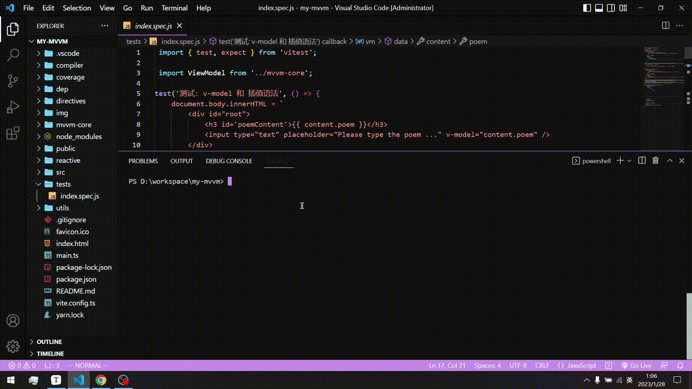
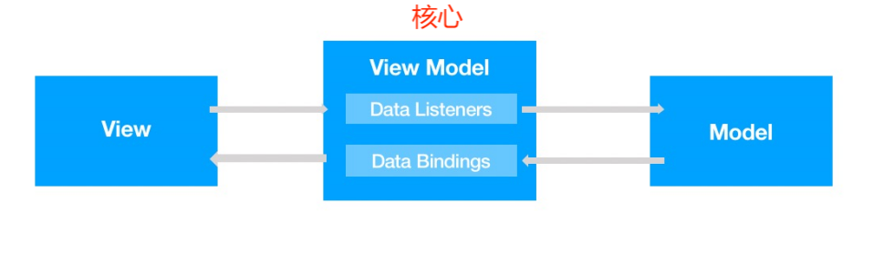
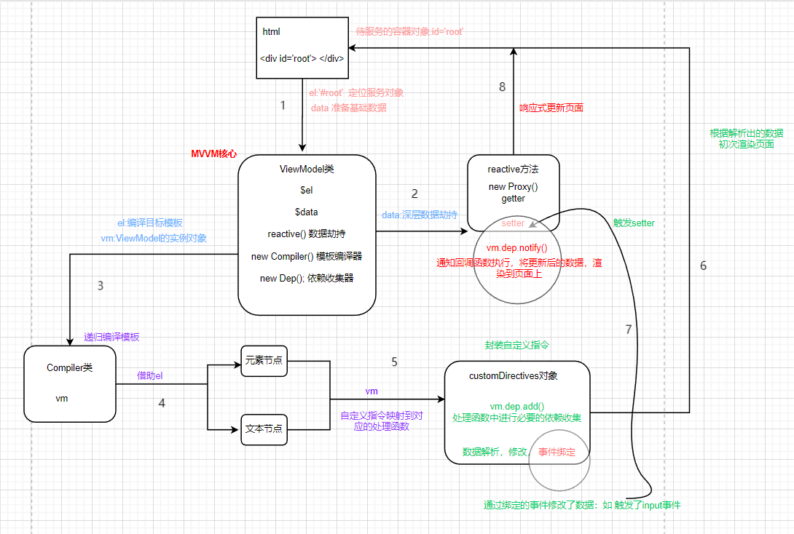
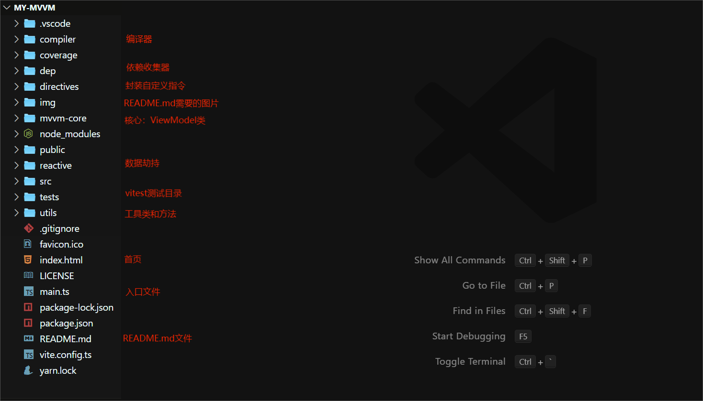
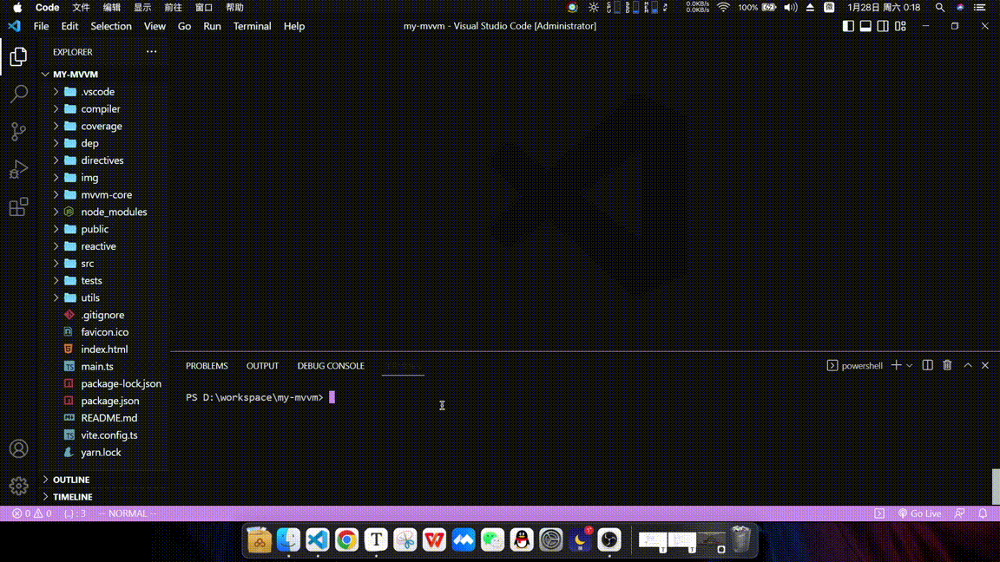

### 仓库说明

- 用于存放2023百度前端实战训练营的大作业：实现一个简易的MVVM框架
- 作者：王勋
- 学校：东北林业大学 
- 专业年级：20级本科 软件工程
- 个人或组队：个人
- 个人博客园地址: https://www.cnblogs.com/nefu-wangxun/ 欢迎相互交流学习

### 项目简介

- 项目名称：my-mvvm

- 功能实现：数据劫持，数据单向绑定，数据双向绑定，消息的订阅与发布，依赖收集，模板解析，响应式页面更新

### 亮点：

- 项目架构层次：

  - 使用vite构建项目，并配套使用vitest作为前端测试框架，项目构建和测试更加简洁高效，便于维护

  - 分模块进行开发，各模块职责分明，耦合度低，易于扩展
  - vitest单元测试中对 v-model双向绑定，v-bind单向绑定,  {{}}插值语法，深度数据劫持，消息订阅与发布，依赖收集等都进行了测试
- 技术实现层次：

  - 实现reactive方法，对数据进行深度劫持，并实现了getDeepValue和setDeepValue方法，可灵活获取和修改对象的深层次属性
  - 实现Compiler类，完成模板解析，并对自定义指令进行了封装，可以将不同自定义指令方便的映射到对应的处理方法上，自定义指令易扩展
  - 实现Dep类，进行依赖收集，可便捷的实现数据的双向绑定，响应式页面，以及消息的订阅与发布

---

### 效果预览

- my-mvvm 框架代码运行演示


- my-mvvm 测试代码运行演示



---

### MVVM 框架设计思路

- MVVM整体架构



- 本质上，MVVM的核心就是充当驱动的ViewModel层，ViewModel通过对数据的监测和绑定，并通过触发和响应事件，实现数据的维护和视图的更新
- 所以此简易的MVVM框架的核心也是维护一个ViewModel类，来统筹整个框架

### MVVM 核心类和方法

- 核心类和方法架构设计图：深红色表示核心类和操作，其他颜色用于区别职责划分



---

### 项目结构说明

> 红字标识的目录和文件是作者创建完成的，其余文件和目录是项目构建工具生成的



### 核心类和方法分析

#### ViewModel类

> MVVM的核心类，用于统筹整个框架

```ts
/**
 * 构造MVVM框架的核心：ViewModel类
 * 
 */


//引入模板编译器
import Compiler from "../compiler/Compiler";
//引入依赖收集器
import Dep from "../dep/Dep";
//引入数据劫持方法
import reactive from "../reactive/reactive";

export default class ViewModel {
    $el:HTMLElement;
    $data:Object;
    dep:Dep
    compiler:Compiler
    
    //解构传来的options配置对象
    constructor({
        el,  //string
        data //function
    }){
        
        //拿到待操作的容器对象
        this.$el = document.querySelector(el);

        //对传来的data数据进行数据劫持
        this.$data = reactive(this, data());

        //在vm对象上添加一个依赖收集对象
        this.dep = new Dep();

        //编译页面
        this.compiler = new Compiler(this);
    }
}
```

#### reactive方法

> 对传来的数据对象进行深度数据劫持, 并对有过依赖收集的变量进行消息通知，执行回调函数

```ts
/**
 * 对传来的数据对象进行数据劫持
 */
import ViewModel from '../mvvm-core';

export default function reactive (vm:ViewModel, data:Object) {
    
    return new Proxy(data, {
        get: (target, key) => {
            const value = Reflect.get(target, key); //return target[key]
            return value !== null && typeof value === 'object' ? reactive(vm, value) : value; //深度劫持
        },
        set: (target, key, value) => {
            //修改数据，并记录是否修改成功
            const isSuccess = Reflect.set(target, key, value); //target[key] = value

            //console.log(key, value);

            //数据修改时，通知并执行对应的回调函数数组中的回调函数
            vm.dep.notify(key);
            
            return isSuccess;
        }
    })
}
```

#### Compiler类

> 将待服务的目标模板，分为元素节点和文本节点两大类进行解析，并将自定义指令映射到对应的处理方法上

```ts
/**
 * 编译器:编译待服务的容器对象所对应的html模板文件，解析自定义标签
 */


//引入编译页面时需要使用的工具类
import CompilerUtils from "../utils/CompilerUtils";

//引入封装了所有自定义指令的对象
import customDirectives from "../directives/customDirectives";

//引入正则表达式对象:判断是否为插值语法格式
import {isInterpolationSyntax} from "../utils/RegExprUtils";

import ViewModel from "../mvvm-core";

export default class Compiler {
    vm:ViewModel

    constructor(vm:ViewModel){
        this.vm = vm;

        //初次编译
        this.compile(this.vm.$el as HTMLDivElement);
    }

    //对节点进行初步编译
    compile($el:HTMLDivElement){

        const childNodes = $el.childNodes;  //得到目标容器对象的所有子节点

        //按照 元素节点，文本节点 两大类进行模板解析
        [...childNodes].forEach(node => {
            if(CompilerUtils.isElementNode(node)){
                this.compileElement(this.vm, node); //编译元素节点
                this.compile(node);     //递归遍历该节点，处理其可能存在的子节点
            }else{
                this.compileText(this.vm, node);    //编译文本节点
            }
        })
    }

    //编译元素节点
    compileElement(vm:ViewModel, node){
        const attrs = node.attributes;  //获取元素节点的所有属性
        [...attrs].forEach(attr => {
            //判断属性名是否为自定义指令
            if(CompilerUtils.isDirective(attr.name)){
                //如果包含自定义指令，获取自定义指令的具体类型并拿到自定义指令的值
                const [, vType] = attr.name.split('-'); //v-model -> ['v', 'model']，这里只要数组的第二个元素
                customDirectives[vType](vm, node, attr.value);  //根据具体的自定义指令类型，调用对应的处理函数
            }
        })
    }

    //编译文本节点
    compileText(vm:ViewModel, node){
        const text = node.textContent;
        if(isInterpolationSyntax.test(text)){
            //如果符合插值语法对应的正则表达式,进行插值语法的解析
            customDirectives['text'](vm, node, text);
        }
    }
}
```

#### customDirective对象

> 封装了自定义指令，根据编译结果，映射到对应的处理方法

```ts
/**
 * 封装各种具体的自定义指令
 */


import {isInterpolationSyntax} from "../utils/RegExprUtils";

import {getDeepValue, setDeepValue} from "../utils/deepValueUtils";

import ViewModel from '../mvvm-core';

export default {
    
    /**
     * bind: v-bind 单向数据绑定
     * model: v-model 双向数据绑定
     * text: {{}} 插值语法
     */

    bind(vm:ViewModel, node:HTMLElement, value:String){
        //初次渲染元素节点中的value
        node.value = getDeepValue(vm.$data, value);
        
        //移除页面中的v-bind属性
        node.removeAttribute('v-bind'); 
    },
    model(vm:ViewModel, node:HTMLElement, value:String) {
        //初次渲染元素节点中的value
        const callBack = () => node.value = getDeepValue(vm.$data, value);
        callBack();

        //收集依赖:实现数据的双向绑定
        const prop = value.split('.').slice(-1);//获取变量名
        vm.dep.add(prop, callBack);
        // console.log('modle', value);

        //绑定input监听事件
        node.addEventListener('input', () => {
            // vm.$data[value] = node.value;
            setDeepValue(vm.$data, value, node.value);
            // console.log(getDeepValue(vm.$data, value));
        }, false)
        
        //移除页面中的v-model属性
        node.removeAttribute('v-model'); 
    },
    text(vm:ViewModel, node:HTMLElement, text:String) {
        //保存绑定的变量名
        let variableName = '';

        //初次渲染文本节点中的value
        const callBack = () => {
            //将文本节点内容中的插值语法表达式，替换成插值语法表达式中变量对应的值，如:{{ title }} -> title
            node.textContent = text.replace(isInterpolationSyntax, (textNode, key) => {
                key = key.trim(); //为变量名去空格
                variableName = key; //保存变量名
                return getDeepValue(vm.$data, key);
            })
        }
        callBack();

        //依赖收集: 实现双向数据绑定
        const prop = variableName.split('.').slice(-1);//获取变量名
        vm.dep.add(prop, callBack);
    }
}
```

#### Dep类

> 进行依赖收集，帮助实现数据的双向绑定和消息的发布与订阅

```ts
/**
 * 进行依赖收集
 */


export default class Dep {

    //将绑定的变量名作为key,修改该变量值的操作封装成一个个callBack回调函数并放到一个专门属于该变量的回调函数数组中
    add(key:String, callBack:Function){
        !this[key] ? this[key] = [callBack]
                   : this[key].push(callBack);
    }

    //如果进行过依赖收集，当绑定的数据被修改时，通知回调数组中的所有回调函数执行，更新数据
    notify(key:String){
        if(this[key]){ 
            this[key].forEach(callBack => callBack());
        }
    }

}
```

#### utils 核心工具类和方法

- CompilerUtils：编译模板时使用到的方法

```ts
/**
 * 封装在编译模板时需要用到的一些方法
 */


export default class CompilerUtils {
    
    //判断节点是否为元素节点
    static isElementNode(node:HTMLElement) {
        return node.nodeType === 1;
    }

    //判断属性名中是否含有自定义指令
    static isDirective(attrName:String) {
        return attrName.includes('v-');
    }
}
```

- deepValueUtils：读取和设置对象的深层属性

```ts
/**
 * 根据传入的对象和获取路径，返回目标层次深度所对应的值
 * 例如：
 * obj:{
 *  a:{
 *     b:{
 *       c:1
 *      }
 *    }
 *  }
 * 
 * 则传入 obj 和 'a.b.c' 应当返回 1
 */


//获取对象的深层次属性值
export function getDeepValue(obj:Object,path:String){
    let res = obj;
    let current = '';
    let pathArr = path.split('.'); //形如:['a', 'b', 'c']
    while(current = pathArr.shift()){
        res = res[current];
    }
    return res;
}


//设置对象的深层次属性值
export function setDeepValue(obj:Object, path:String, newValue:String){
    let res = obj;
    let current = '';
    let pathArr = path.split('.'); //形如:['a', 'b', 'c']
    let n = pathArr.length;
    while(current = pathArr.shift()){
        n--;
        if(n == 0){
            res[current] = newValue; //修改目标属性值为新值
            break;
        }
        res = res[current];
    }
}
```

- RegExprUtils：封装使用到的正则表达式

```ts
/**
 * 封装使用到的正则表达式
 */


//判断是否满足双花括号的插值语法格式, 即：{{}}
export const isInterpolationSyntax = /\{\{(.+?)\}\}/
```

### 单元测试

> 使用与vite相互配套的vitest进行单元测试，并用happy-dom作为dom测试环境

- 测试文件放在tests目录中

```js
import { test, expect } from 'vitest';

import ViewModel from '../mvvm-core';

test('测试: v-model 和 插值语法', () => {
    document.body.innerHTML = `
        <div id="root">
            <h3 id='poemContent'>{{ content.poem }}</h3>
            <input type="text" placeholder="Please type the poem ..." v-model="content.poem" />
        </div>
    `
    const vm = new ViewModel({
        el:'#root',
        data(){
            return {
                content:{
                    poem:'偶尔想念'
                }
            }
        }
    })

    //测试页面初次渲染时，模板是否正常解析
    expect(document.getElementById('poemContent').innerText === '偶尔想念').toBe(true);

    //修改poem值
    vm.$data.content.poem = '经常偶尔';

    //测试双向数据绑定是否成功，页面是否响应式的变化
    expect(document.getElementById('poemContent').innerText === '经常偶尔').toBe(true);

})

test('测试: v-bind 和 插值语法', () => {
    document.body.innerHTML = `
        <div id="root">
            <h3 id='poemContent'>{{ poem }}</h3>
            <input id='input' type="text" placeholder="Please type the title ..." v-bind="poem" />
        </div>
    `
    const vm = new ViewModel({
        el:'#root',
        data(){
            return {
                poem:'偶尔想念'
            }
        }
    })
    //测试初始渲染
    expect(document.getElementById('poemContent').innerText === '偶尔想念').toBe(true);
    expect(document.getElementById('input').value === '偶尔想念').toBe(true);
    //修改poem
    vm.$data.poem = '经常偶尔';
    //测试文本节点是否正常的响应式更新
    expect(document.getElementById('poemContent').innerText === '经常偶尔').toBe(true);
    //测试单向数据绑定是否成功，input中的数据应当不随着poem的改变而更新
    expect(document.getElementById('input').value === '偶尔想念').toBe(true);
})

test('测试: 深度数据劫持 和 消息订阅与发布', () => {
    const vm = new ViewModel({
        el:'#root',
        data(){
            return {
                a:{
                    b:{
                        c:{
                            d:1
                        }
                    }
                }
            }
        }
    })

    //一旦d值被修改，由于对data数据进行了深度数据劫持，可以检测到d值修改，同时通知消息回调函数执行

    
    let result = '';
    //消息回调函数
    const callBack = () => {
        result = 'd被修改了';
    }
    //对d进行依赖收集
    vm.dep.add('d', callBack);
    //修改d值
    vm.$data.a.b.c.d = 2;
    expect(result === 'd被修改了').toBe(true);
    
})
```

#### 测试过程演示


### MVVM 代码演示

#### 演示过程




#### 演示结果分析

- html核心代码

```html
<body>
    <!--模块化引入-->
    <script type="module" src="./main.ts"></script>
    
    <!--单向数据绑定，双向数据绑定，深度数据劫持，消息的订阅与发布-->
    <div id="root">
        <h3>标题: {{ title }}</h3>
        <h3>内容: 偶尔想念, {{ content.poem }}</h3>
        双向数据绑定: <input type="text" placeholder="Please type the content ..." v-model="content.poem" />
        单向数据绑定: <input type="text" placeholder="Please type the title ..." v-bind="title" />
    </div>
</body>
```

- main.ts

```ts
//引入mvvm框架的核心，即:ViewModel类

import ViewModel from "./mvvm-core";

const vm = new ViewModel({
    el:'#root',
    data(){
        return {
            content:{
                poem:''
            },
            title:'my mvvm'
        }
    }
})
```

- 实现了模板解析，初次渲染页面时，{{}}中的变量，以及绑定的变量会被解析，页面会呈现数据的初始值
- 对content.poem进行了双向数据绑定，并对数据对象进行了深层数据劫持，可以监测到poem的修改
- 又由于进行了依赖收集，poem修改时会通知收集到的回调函数执行
- 所以h3标签中的{{content.poem}}也被重新解析和替换成新值，并重新渲染页面，同步更新
- 而对title进行了单向数据绑定，title值不会被修改，所以h3标签中的{{title}}也不会被被重新解析和渲染


### 后记

> my-mvvm框架只是简单的实现了 数据绑定，数据劫持，消息的订阅与发布，响应式页面等基础功能，功能并不是很完善
>
> 由于时间有限，后续会不断的完善现有功能并扩展my-mvvm框架
>
> 
>
> 这次训练营真的收获了很多，希望可以更加充实的度过刚刚到来的2023年，慢慢成长，逐渐发光

